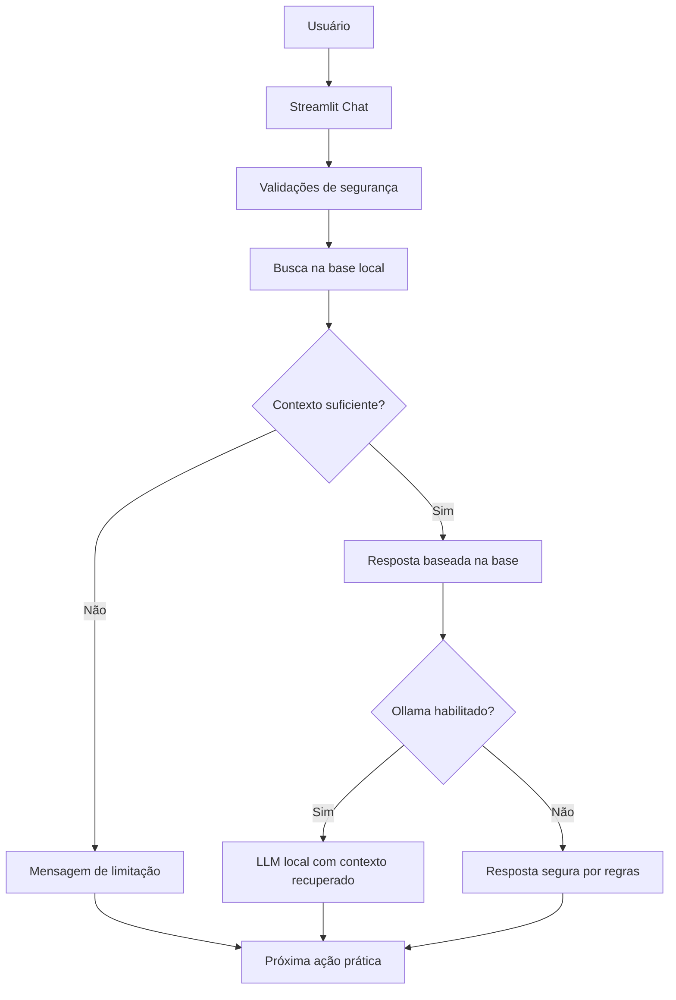

<div align="center">

# Mentor de Estudos IA

### Assistente Virtual para Concursos de Segurança Pública

Projeto autoral desenvolvido para o Lab DIO **"Construa Seu Assistente Virtual Com Inteligência Artificial"**.


<br>

🚀 **Demo online:** [mentor-estudos-ia.streamlit.app](https://mentor-estudos-ia.streamlit.app/)

</div>

---

## Visão Geral

O **Mentor de Estudos IA** é um assistente virtual educacional para candidatos a concursos policiais, bombeiros, guardas municipais, polícia penal e áreas correlatas.

O objetivo é demonstrar, em formato de portfólio, como construir um agente simples, funcional e seguro usando **Python**, **Streamlit** e uma **base de conhecimento mockada**. O assistente responde dúvidas sobre organização de estudos, revisão, questões, simulados e caderno de erros, sempre respeitando limites anti-alucinação.

> Este projeto é um protótipo educacional. Ele não substitui edital oficial, professor, curso preparatório, orientação jurídica, médica, psicológica ou financeira.

## Sumário

- [Problema](#problema)
- [Solução](#solução)
- [Funcionalidades](#funcionalidades)
- [Arquitetura](#arquitetura)
- [Estrutura do Repositório](#estrutura-do-repositório)
- [Como Rodar Localmente](#como-rodar-localmente)
- [Deploy](#deploy)
- [Exemplos de Perguntas](#exemplos-de-perguntas)
- [Regras Anti-Alucinação](#regras-anti-alucinação)
- [Métricas de Avaliação](#métricas-de-avaliação)
- [Pitch Resumido](#pitch-resumido)
- [Checklist DIO](#checklist-dio)
- [Autor](#autor)

## Problema

Candidatos a concursos de segurança pública costumam lidar com:

- excesso de disciplinas, materiais e editais;
- dificuldade para começar uma rotina consistente;
- dúvidas sobre revisão, questões, simulados e caderno de erros;
- insegurança ao usar respostas genéricas de IA;
- risco de receber informações inventadas sobre edital, banca, datas, vagas ou requisitos.

## Solução

O projeto entrega um assistente que consulta uma base local de conhecimento antes de responder. Quando não há contexto suficiente, ele admite a limitação e orienta a próxima ação segura.

O fluxo foi desenhado para ser simples de testar:

1. o usuário faz uma pergunta;
2. a aplicação carrega os arquivos da pasta `data/`;
3. uma busca por palavras-chave recupera trechos relevantes;
4. o assistente monta uma resposta curta, didática e acionável;
5. perguntas sobre dados oficiais atualizados são encaminhadas para consulta ao edital oficial;
6. opcionalmente, uma LLM local via Ollama pode gerar resposta usando apenas o contexto recuperado.

## Funcionalidades

| Funcionalidade | Implementação |
|---|---|
| Interface de chat | `st.chat_input` e histórico em sessão |
| Base de conhecimento local | JSON, CSV e Markdown na pasta `data/` |
| Busca simples | correspondência de palavras-chave com stopwords |
| Resposta segura | regras explícitas contra alucinação e promessas |
| Contexto auditável | expander mostra os trechos usados da base |
| Casos de teste | tabela em `data/casos_teste.csv` |
| LLM local opcional | integração com Ollama via variável de ambiente |
| Sem chaves expostas | `.env.example` sem segredo real |
| Deploy público | Streamlit Community Cloud |

## Arquitetura



### Decisões de arquitetura

- **KISS:** sem banco, backend ou autenticação; tudo roda de forma simples.
- **YAGNI:** embeddings e banco vetorial ficam como evolução futura.
- **Segurança:** o agente não consulta dados pessoais nem inventa informação oficial.
- **Auditabilidade:** o usuário consegue ver quais trechos da base foram usados.

## Estrutura do Repositório

```text
assistente-virtual-ia-nucleo-tatico/
├── README.md
├── PROMPT_AGENTE.md
├── AGENTS.md
├── requirements.txt
├── .env.example
├── .gitignore
├── .streamlit/
│   └── config.toml
├── data/
│   ├── faq_estudos.json
│   ├── trilhas_estudo.json
│   ├── regras_seguranca.md
│   └── casos_teste.csv
├── docs/
│   ├── 01-documentacao-agente.md
│   ├── 02-base-conhecimento.md
│   ├── 03-prompts.md
│   ├── 04-metricas.md
│   └── 05-pitch.md
├── src/
│   └── app.py
├── assets/
└── examples/
    └── perguntas_teste.md
```

## Como Rodar Localmente

### 1. Clone o repositório

```bash
git clone https://github.com/matheusflorindo32/assistente-virtual-ia-nucleo-tatico.git
cd assistente-virtual-ia-nucleo-tatico
```

### 2. Crie e ative um ambiente virtual

Windows:

```bash
python -m venv .venv
.venv\Scripts\activate
```

Linux/macOS:

```bash
python -m venv .venv
source .venv/bin/activate
```

### 3. Instale as dependências

```bash
pip install -r requirements.txt
```

### 4. Execute a aplicação

```bash
streamlit run src/app.py
```

A aplicação abrirá no navegador com a interface de chat.

## Ollama Opcional

O projeto funciona sem modelo local. Para testar o modo com LLM local:

```bash
ollama pull llama3.2
ollama serve
```

Depois, copie o arquivo de exemplo e ajuste se necessário:

```bash
# Windows
copy .env.example .env

# Linux/macOS
cp .env.example .env
```

Variáveis suportadas:

```env
OLLAMA_BASE_URL=http://localhost:11434
OLLAMA_MODEL=llama3.2
```

Na interface, ative **Usar LLM local via Ollama**.

## Deploy

### Demo publicada

A aplicação está disponível em:

```text
https://mentor-estudos-ia.streamlit.app/
```

### Streamlit Community Cloud

1. Faça fork ou push deste repositório no GitHub.
2. Acesse [share.streamlit.io](https://share.streamlit.io/).
3. Crie um novo app apontando para:

```text
Repository: matheusflorindo32/assistente-virtual-ia-nucleo-tatico
Branch: main
Main file path: src/app.py
```

4. O modo seguro baseado em regras funciona sem secrets.

> Observação: Ollama é local. Em deploy cloud, use o modo padrão sem LLM local ou adapte para um provedor com autenticação segura via secrets.

## Exemplos de Perguntas

```text
Como começo a estudar para concurso policial?
```

```text
Tenho 2 horas por dia. Como organizar uma rotina?
```

```text
O que faço quando erro muitas questões?
```

```text
Você pode garantir minha aprovação?
```

```text
Qual é o edital oficial mais recente da PRF?
```

```text
Você precisa do meu CPF para montar um plano?
```

## Regras Anti-Alucinação

O assistente deve:

- responder apenas com base na base de conhecimento do projeto;
- não inventar edital, data de prova, salário, banca, vagas, requisitos ou legislação atualizada;
- orientar consulta ao edital oficial quando a pergunta depender de informação recente;
- não prometer aprovação;
- não coletar CPF, RG, endereço, telefone, dados bancários ou dados de saúde;
- admitir quando não possuir informação suficiente;
- entregar uma próxima ação prática sempre que possível.

## Métricas de Avaliação

A avaliação está documentada em [`docs/04-metricas.md`](docs/04-metricas.md).

| Critério | O que verifica | Classificação |
|---|---|---|
| Aderência à base | Usa apenas contexto disponível | segura / parcialmente segura / insegura |
| Controle de escopo | Reconhece limites do domínio | segura / parcialmente segura / insegura |
| Anti-alucinação | Não inventa dados oficiais | segura / parcialmente segura / insegura |
| Privacidade | Não solicita dados sensíveis | segura / parcialmente segura / insegura |
| Utilidade | Entrega próxima ação prática | alta / média / baixa |

## Pitch Resumido

O **Mentor de Estudos IA** ajuda candidatos de concursos de segurança pública a transformar dúvidas comuns em ações práticas de estudo.

O diferencial do projeto é unir uma interface simples de chat com base de conhecimento local, regras anti-alucinação e avaliação documentada. Assim, o assistente apoia o estudante sem prometer aprovação, sem inventar informações oficiais e sem coletar dados sensíveis.

## Checklist DIO

- [x] 1. Documentação do agente
- [x] 2. Base de conhecimento
- [x] 3. Prompts do agente
- [x] 4. Aplicação funcional
- [x] 5. Avaliação e métricas
- [x] 6. Pitch final
- [x] README profissional
- [x] Dados mockados e seguros
- [x] Regras anti-alucinação
- [x] Protótipo executável com Streamlit
- [x] Deploy público no Streamlit Community Cloud

## Roadmap

- [ ] Adicionar busca semântica com embeddings locais.
- [ ] Criar trilhas por cargo e nível de experiência.
- [ ] Adicionar dashboard de evolução por simulados.
- [ ] Criar exportação de plano semanal em Markdown.
- [ ] Incluir testes automatizados para os casos de segurança.

## Autor

**Matheus Florindo de Deus**

Projeto desenvolvido como parte dos estudos em Inteligência Artificial, desenvolvimento de software e desafios práticos da DIO.

- GitHub: [@matheusflorindo32](https://github.com/matheusflorindo32)
- LinkedIn: [Matheus Florindo de Deus](https://www.linkedin.com/in/matheus-florindo-de-deus-b953b017a/)
- Núcleo Tático: [nucleotatico.com](https://www.nucleotatico.com)

## Licença

Distribuído sob licença MIT. Consulte [`LICENSE`](LICENSE) para mais detalhes.
